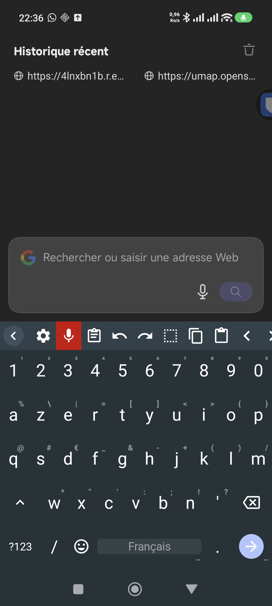
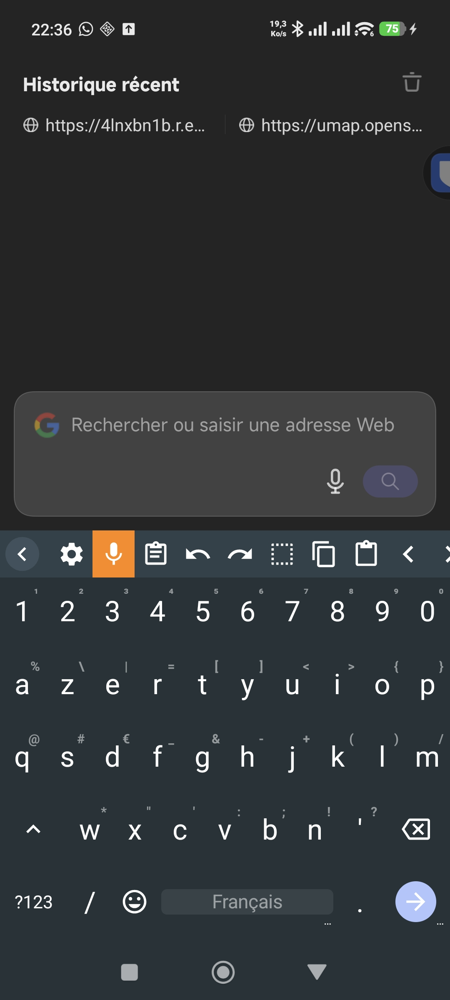
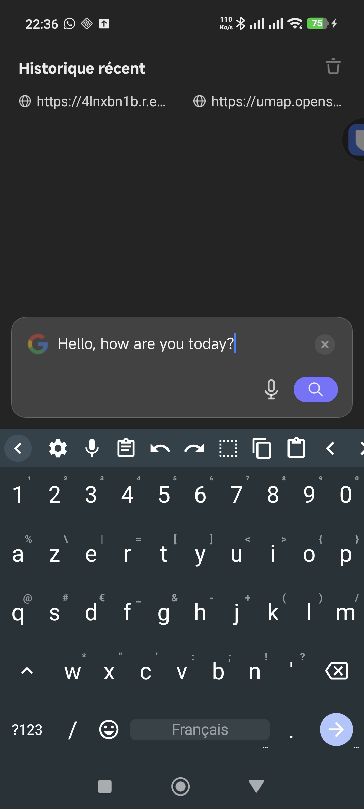
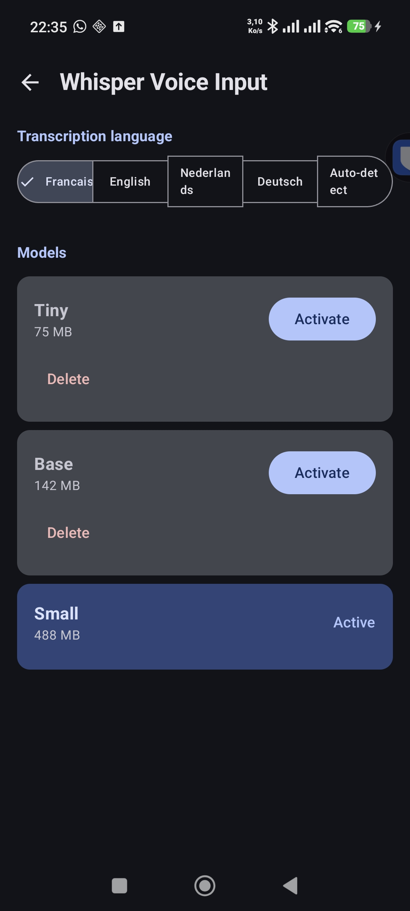

# WhisperBoard

Android keyboard with **voice transcription** — on-device or cloud-powered. Built on [HeliBoard](https://github.com/Helium314/HeliBoard) with [whisper.cpp](https://github.com/ggerganov/whisper.cpp) for local STT and [Deepgram Nova-3](https://deepgram.com) for near-instant cloud STT.

[Download latest APK](https://github.com/david-digitis/WhisperBoard/releases/latest)

## Screenshots

<p align="center">
  
  
  
  
</p>

**Left to right:** Recording (red mic) | Transcribing (orange mic) | Result | Settings

## Features

- **Two transcription modes:**
  - **Cloud (Deepgram Nova-3):** near-instant results (~300ms), text appears as you speak
  - **Local (Whisper):** 100% on-device, no internet required, no data sent anywhere
  - **Auto:** uses cloud when available, falls back to local offline
- 3 Whisper models: **Base** (142 MB), **Small** (488 MB), **Small FR** (488 MB, French-optimized)
- In-app model download
- Language support: French, English, Dutch, German, Auto-detect
- Visual feedback: red mic while recording, orange while transcribing
- Haptic feedback on start/stop recording
- Full HeliBoard keyboard: AZERTY/QWERTY, autocorrect, themes, gesture typing

## How it works

1. Tap the **mic button** in the toolbar (short vibration)
2. Speak
3. Tap the mic button again (longer vibration)
4. Text appears in the input field

In **Cloud mode**, results are nearly instantaneous. In **Local mode**, transcription takes 2-5 seconds depending on the model.

## Cloud mode setup (optional)

Cloud mode uses [Deepgram](https://deepgram.com) for fast, accurate speech-to-text. You get **$200 free credit** on signup (enough for ~430 hours of dictation).

1. Create a free account at [deepgram.com](https://deepgram.com)
2. Generate an API key in your dashboard
3. Open WhisperBoard settings > **Whisper Voice Input**
4. Set mode to **Cloud** or **Auto**
5. Paste your API key

Your API key is stored locally on your device. Audio is streamed to Deepgram's servers for transcription — if privacy is a concern, use **Local** mode instead.

**Cost:** ~$0.0077/min (pay-as-you-go). Typical keyboard dictation usage costs a few dollars per month.

## Install

### From APK (recommended)

1. Download the latest APK from [Releases](https://github.com/david-digitis/WhisperBoard/releases/latest)
2. Install on your Android device (enable "Install from unknown sources" if needed)
3. Go to **Settings > System > Languages & Input > On-screen keyboard** and enable WhisperBoard
4. Switch to WhisperBoard in any text field
5. Open WhisperBoard settings > **Whisper Voice Input** > download a model (for local mode) or enter your Deepgram API key (for cloud mode)

### Build from source

Requirements: Android Studio, NDK 28+, CMake 3.22+

```bash
git clone --recurse-submodules https://github.com/david-digitis/WhisperBoard.git
cd WhisperBoard
./gradlew assembleDebug
```

The APK will be at `app/build/outputs/apk/debug/WhisperBoard_3.7-debug.apk`.

## Models (local mode)

| Model | Size | Speed | Accuracy | Best for |
|-------|------|-------|----------|----------|
| Base  | 142 MB | ~2s | Good | Quick notes |
| Small | 488 MB | ~5s | Very good | General use |
| Small FR | 488 MB | ~5s | Excellent (French) | French dictation (recommended) |

Models are downloaded in-app and stored locally on your device.

## Architecture

```
WhisperBoard/
├── app/                          # HeliBoard keyboard app
│   └── src/main/java/.../whisper/
│       ├── WhisperManager.kt     # Recording + transcription orchestrator (cloud/local routing)
│       ├── DeepgramClient.kt     # Deepgram Nova-3 WebSocket streaming client
│       ├── WhisperModelManager.kt # Local model download management
│       └── AudioRecorder.kt      # 16kHz PCM mono recording (streaming + batch modes)
├── whisperlib/                   # Android library module
│   └── src/main/jni/whisper/
│       ├── jni.c                 # C bridge (14 JNI functions)
│       └── CMakeLists.txt        # whisper.cpp build config
└── whisper.cpp/                  # Git submodule (v1.8.3)
```

## Credits

- [HeliBoard](https://github.com/Helium314/HeliBoard) — the keyboard (GPL-3.0)
- [whisper.cpp](https://github.com/ggerganov/whisper.cpp) — C/C++ port of OpenAI Whisper (MIT)
- [kaiboard](https://github.com/kaisoapbox/kaiboard) — JNI bridge reference
- [Deepgram](https://deepgram.com) — cloud STT API
- [OkHttp](https://square.github.io/okhttp/) — WebSocket client

## License

- Keyboard (HeliBoard fork): [GPL-3.0](LICENSE)
- whisper.cpp: [MIT](whisper.cpp/LICENSE)
